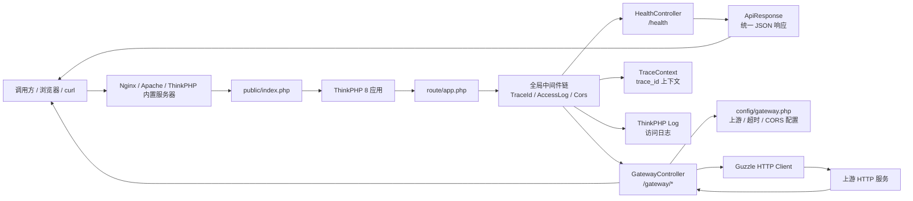
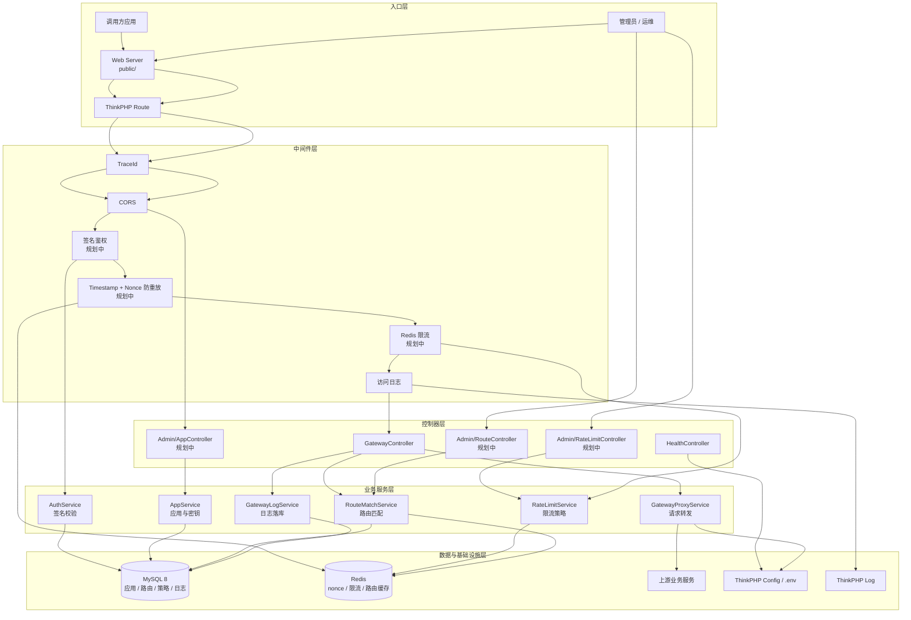
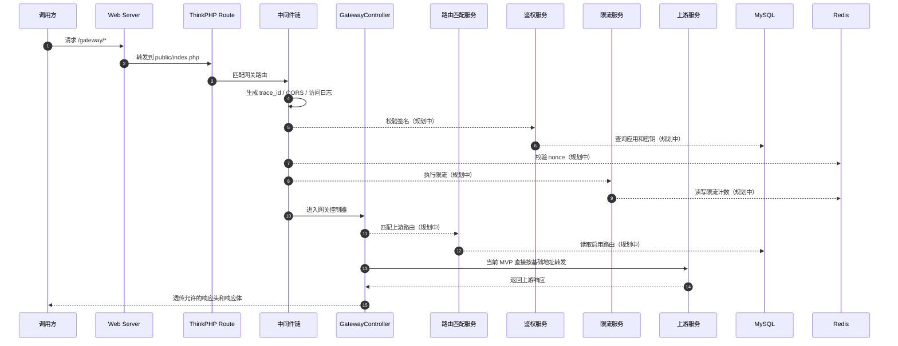
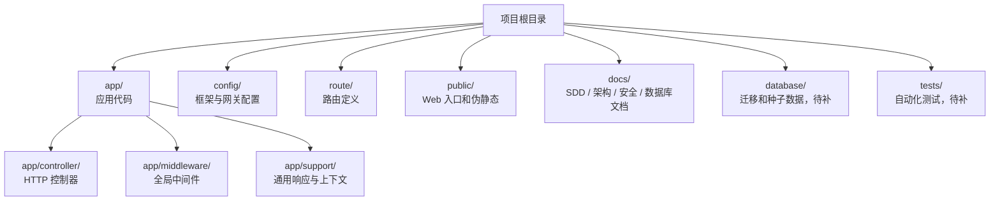

# API 网关框架图

本文用 Mermaid 描述当前 API 网关的项目框架、请求链路和后续目标架构。当前代码仍处于最小 MVP 阶段，图中会明确区分“已实现”和“规划中”能力。

## 1. 当前 MVP 框架图

当前已落地的核心能力：

- `TraceId` 中间件负责生成或透传 `X-Trace-Id`。
- `AccessLog` 中间件负责记录请求路径、状态码、耗时和客户端 IP。
- `Cors` 中间件负责跨域响应头和 `OPTIONS` 预检。
- `HealthController` 提供 `/health` 健康检查入口。
- `GatewayController` 基于 `GATEWAY_UPSTREAM_BASE_URL` 做简单 HTTP 转发。
- `ApiResponse` 负责健康检查、路由不存在、上游异常等统一 JSON 响应。

## 2. 目标分层架构图

目标分层原则：

- 控制器只负责接收请求、参数编排和响应封装。
- 鉴权、限流、防重放优先放在中间件和服务层，不堆在控制器里。
- MySQL 保存长期业务数据，Redis 保存短生命周期运行状态。
- 上游转发必须受协议、Host 白名单、超时和请求体大小约束。

## 3. 网关请求时序图

## 4. 目录职责图

## 5. 现状与下一步

当前项目已经具备最小请求链路，后续建议按以下顺序扩展：

1. 补齐 MySQL 迁移和基础模型。
2. 抽出 `GatewayProxyService`，让控制器继续保持薄层。
3. 实现应用管理、路由管理和限流策略管理接口。
4. 实现 HMAC-SHA256 签名鉴权、timestamp 窗口校验和 Redis nonce 防重放。
5. 实现 Redis 限流和请求日志落库。
6. 补齐核心服务单元测试和网关主链路接口测试。
